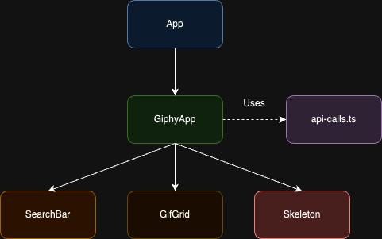

## Components and State Management

### 1. GiphyApp (Main Component)

The `GiphyApp` component serves as the main container for the application. It manages the overall state and orchestrates the interaction between child components.

#### State Management:
- `useState`:
  - `gifs`: Stores the array of GIFs fetched from the API.
  - `query`: Keeps track of the current search query.
  - `loading`: Indicates whether a fetch operation is in progress.
  - `offset`: Manages the pagination offset for API requests.

#### useEffect:
- Fetches trending GIFs when the component mounts.

#### Key Functions:
- `fetchGifs`: Retrieves trending GIFs from the API.
- `handleSearch`: Initiates a search based on user input.
- `search`: Performs the actual search API call.
- `loadMore`: Fetches additional GIFs and appends to the existing ones.

### 2. SearchBar

A reusable component for user input, triggering searches in the parent component.

#### Props:
- `onSearch`: Callback function to initiate a search.

#### State Management:
- `useState`: Manages the `searchTerm` entered by the user.

### 3. GifGrid

Responsible for rendering the grid of GIFs or skeleton loaders while content is being fetched.

#### Props:
- `gifs`: Array of GIF objects to display.
- `loading`: Boolean indicating whether content is being loaded.

### 4. Skeleton

A utility component for displaying placeholder content while GIFs are being loaded.

#### Props:
- `count`: Number of skeleton items to render.

## API Integration

The `api-calls.ts` file encapsulates the logic for interacting with the Giphy API:

- `fetchTrendingGifs`: Retrieves trending GIFs.
- `searchGifs`: Performs a search query for GIFs.

Both functions utilize Axios for making HTTP requests and handle pagination through `limit` and `offset` parameters.




## Optional improvements suggested

- A user should be able to save and unsave GIFs, and they should be able to see their saved GIFs, which should persist after closing or refreshing the page.

To implement this, a new state could be introduced to keep track of the saved GIFs. For persistence, we would use local storage. The `useEffect` hook in React could be used to update local storage whenever the savedGifs state changes.

- Adding an animation to the "save" or "like" button to make it more fun to save a GIF.

For this, we could leverage Tailwind CSS to animate the save button. For example, we could apply a transition-transform with a duration of 300–500ms to create a smooth scale-up effect.


## Potential Areas for Testing

1. **GiphyApp Component**:
   - Test initial rendering and state.
   - Ensure search functionality updates the GIFs displayed.
   - Check that the "Show More" button correctly loads additional GIFs.

   Example test: (not verified)
   ```javascript
   test('fetches trending GIFs on mount', async () => {
     render(<GiphyApp />);
     await waitFor(() => {
       expect(screen.getByText('Giphy Search App')).toBeInTheDocument();
       expect(screen.getAllByRole('img')).toHaveLength(20); // Because LIMIT in the code is 20
     });
   });
   ```

2. **SearchBar Component**:
   - Test that user input is correctly captured.
   - Verify that the search function is called with the correct query on form submission.

   Example test: (not verified)
   ```javascript
   test('calls onSearch with correct query on form submission', () => {
     const mockOnSearch = jest.fn();
     render(<SearchBar onSearch={mockOnSearch} />);
     const input = screen.getByPlaceholderText('Search for GIFs');
     const submitButton = screen.getByRole('button');
     
     fireEvent.change(input, { target: { value: 'cats' } });
     fireEvent.click(submitButton);
     
     expect(mockOnSearch).toHaveBeenCalledWith('cats');
   });
   ```

3. **GifGrid Component**:
   - Test rendering of GIFs when provided.
   - Verify that loading state displays the Skeleton component.

4. **API Calls**:
   - Mock API responses and test that the functions correctly parse and return data.

